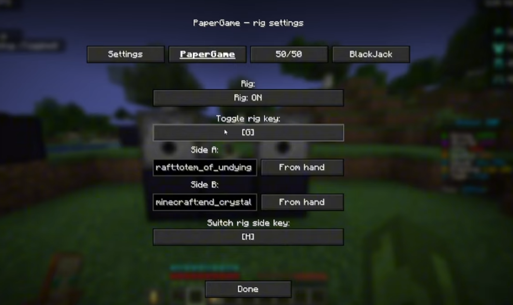

# 🎰 GambleRigMod

> **Paper / Blackjack / 50-50 rig mod** for DonutSMP & other servers

⚡ Fabric **1.21+** • 🃏 Multi-Mode • 🎯 Fast Setup  

---

## 📥 Installation
1. Install **Fabric Loader** → https://fabricmc.net/use/installer/  
2. Download **Fabric API** → https://modrinth.com/mod/fabric-api  
3. Put **Fabric API** + **GambleRigMod** into your `.minecraft/mods` folder  
4. Launch Minecraft using the **Fabric profile**

---

## 🎥 Showcase
▶ https://streamable.com/4yasdi  

## 🖼️ Preview

---

## 🚀 Quick Start
**Open Menu:** `P` *(make sure it’s unbound)*  

**Setup:**
- Hold item → `P` → **Assign Hand**
- Repeat for second item  
- Name items **1–9 only**

---

## ⚙️ Notes
- Uses **2 dispensers + assigned items**
- Built for **DonutSMP**

---

## 💎 Premium
🃏 Full Blackjack + 50/50  
💰 **200m (DonutSMP)**  
📩 Discord: **rvdownsu**
